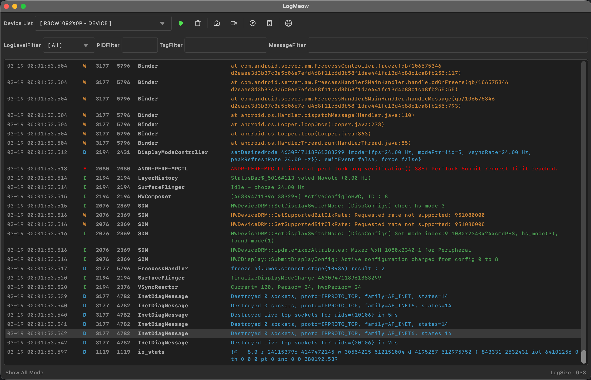
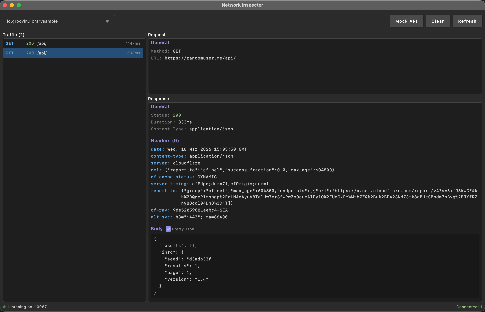
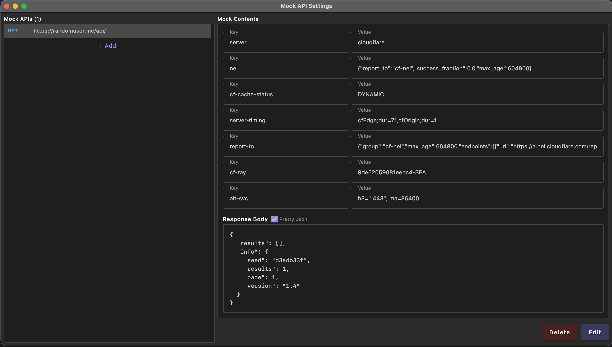

# LogMeow

Android logcat viewer for Desktop (macOS, Windows, Linux)



## Features

- **Logcat Viewer**: Real-time Android logcat monitoring with filtering
- **Log Bookmark**: Bookmark important log lines for quick navigation
- **Network Interceptor**: Inspect HTTP traffic from Android apps in real-time with mock API support
- **Screenshot Capture**: Take device screenshots and save to local directory
- **Screen Recording**: Record device screen to MP4 video
- **DeepLink Execution**: Execute and manage deeplink history
- **Scrcpy Integration**: Launch scrcpy for device mirroring and control

## Requirements

- JDK 17 or higher
- Android SDK with ADB installed
- scrcpy (optional, for device mirroring feature)

### ADB Setup

The application automatically searches for ADB in the following locations:

1. `$ANDROID_HOME/platform-tools/adb` or `$ANDROID_SDK_ROOT/platform-tools/adb`
2. `~/Library/Android/sdk/platform-tools/adb` (macOS)
3. `/usr/local/bin/adb`
4. `/opt/homebrew/bin/adb` (macOS with Homebrew)
5. System PATH

**Recommended Setup (macOS):**

Add to your `~/.zshrc` or `~/.bash_profile`:

```bash
export ANDROID_HOME=$HOME/Library/Android/sdk
export PATH=$PATH:$ANDROID_HOME/platform-tools
```

Then restart your terminal or run `source ~/.zshrc`

### Scrcpy Setup (Optional)

For device mirroring and control feature, install scrcpy:

**macOS (Homebrew):**
```bash
brew install scrcpy
```

**Windows:**
Download from [scrcpy releases](https://github.com/Genymobile/scrcpy/releases)

**Linux:**
```bash
sudo apt install scrcpy  # Debian/Ubuntu
```

The application automatically searches for scrcpy in common installation paths.

## Network Interceptor
[](https://central.sonatype.com/artifact/io.groovin.logmeow/network-interceptor-core)

LogMeow includes a network interceptor library that captures HTTP traffic from your Android app and displays it in the desktop tool's Network Inspector.



### Setup

Add the dependency to your Android app:

**OkHttp:**
```kotlin
// build.gradle.kts
debugImplementation("io.groovin.logmeow:network-interceptor-okhttp:<version>")
releaseImplementation("io.groovin.logmeow:network-interceptor-no-op:<version>")
```

**Ktor:**
```kotlin
// build.gradle.kts
debugImplementation("io.groovin.logmeow:network-interceptor-ktor:<version>")
releaseImplementation("io.groovin.logmeow:network-interceptor-no-op:<version>")
```

### Usage

**OkHttp:**
```kotlin
val client = OkHttpClient.Builder()
    .addInterceptor(LogMeowInterceptor(context))
    .build()
```

**Ktor:**
```kotlin
val client = HttpClient {
    install(LogMeowPlugin) {
        context = applicationContext
    }
}
```

### Configuration Options

```kotlin
// OkHttp
LogMeowInterceptor(
    context = context,
    mockSupportType = MockSupportType.ALWAYS, // ALWAYS, CONNECTED_ONLY, DISABLED
    port = LogMeow.DEFAULT_PORT               // default: 10087
)

// Ktor
install(LogMeowPlugin) {
    context = applicationContext
    mockSupportType = MockSupportType.ALWAYS
    port = LogMeow.DEFAULT_PORT
}
```

### Port Forwarding

LogMeow desktop app communicates with the Android device via ADB reverse port forwarding. The app handles this automatically, but if you need manual setup:

```bash
adb reverse tcp:10087 tcp:10087
```

### Mock API

The Network Inspector includes a Mock API feature that lets you define mock responses for specific endpoints directly from the desktop tool. Mock settings are synced to the Android app in real-time.



## Build Guide

### Run Application

```bash
./gradlew run
```

### Build DMG (macOS)

```bash
./gradlew packageDmg
```

Output: `build/compose/binaries/main/dmg/LogMeow-{version}.dmg`

### Build MSI (Windows)

```bash
./gradlew packageMsi
```

Output: `build/compose/binaries/main/msi/LogMeow-{version}.msi`

### Build DEB (Linux)

```bash
./gradlew packageDeb
```

Output: `build/compose/binaries/main/deb/logmeow_{version}-1_amd64.deb`

### Build for Current OS

```bash
./gradlew packageDistributionForCurrentOS
```

### Create Distributable (without installer)

```bash
./gradlew createDistributable
```

Output: `build/compose/binaries/main/app/`

## Development

### Project Structure

```
src/main/kotlin/
├── adb/              # ADB service and data models
├── di/               # Dependency injection
├── network/          # Network interceptor server
├── ui/               # UI components
│   ├── common/       # Common UI components
│   └── icons/        # Custom icons
└── vm/               # ViewModels

interceptor-core/     # Shared interceptor logic (protocol, client, mock settings)
interceptor-okhttp/   # OkHttp interceptor implementation
interceptor-ktor/     # Ktor client plugin implementation
interceptor-no-op/    # No-op implementation for release builds
```

### Technology Stack

- Kotlin
- Jetpack Compose for Desktop
- Koin (Dependency Injection)
- Kotlinx Coroutines

## License
Copyright 2026 gaiuszzang (Mincheol Shin)

Licensed under the Apache License, Version 2.0 (the "License");
you may not use this file except in compliance with the License.
You may obtain a copy of the License at

http://www.apache.org/licenses/LICENSE-2.0

Unless required by applicable law or agreed to in writing, software
distributed under the License is distributed on an "AS IS" BASIS,
WITHOUT WARRANTIES OR CONDITIONS OF ANY KIND, either express or implied.
See the License for the specific language governing permissions and
limitations under the License.
